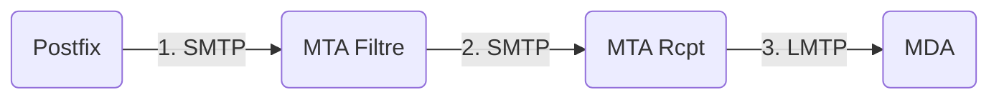
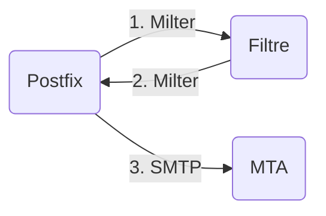
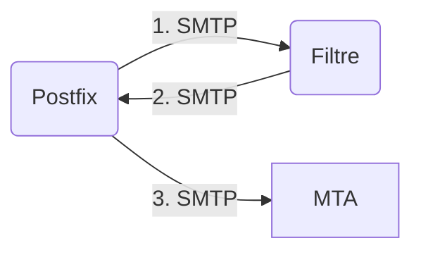

# Detach MTA

Un Mail Transfer Agent (MTA) qui se connecte à Postfix et détache les pièces-jointes des mails pour les uploader sur un CDN.

Approche historique RFC 821 : fichier de taille N, envoyé à X destinataires, empreinte totale du fichier sur les serveurs IMAP : X * N

Approche Detach MTA : fichier de taille N, hébergé sur un serveur unique (ou répliqué), lien (L/N) envoyé à X personnes, empreinte totale du fichier : N (CDN, sans prise en compte de réplication), X * L/N (texte de max 100 caractères = <1 Ko par destinataire)  

## État actuel du projet

- Serveur mail fonctionnel (SMTP/IMAP) sur un serveur hébergé par OVH
    - SMTP: mail.clebard.cloud, port 983, STARTTLS
    - IMAP : mail.clebard.cloud, port 143, SSL/TLS
    - webmail: https://webmail.clebard.cloud
- Postfix envoie les mails au [proxy before_queue](http://www.postfix.org/SMTPD_PROXY_README.html) “fait maison” qui récupère le contenu du mail via un stream, le parse, récupère les attachments (= pièces-jointes) et renvoie le mail sans celles-ci

## Approches

### Approches pour le MTA

#### 1. **Utiliser le paramètre `relayhost` pour envoyer les mails entrants à un serveur qu’on écrit nous-mêmes**

Principe : Récupérer les mails qui entrent sur Postfix, les traiter puis les envoyer nous-mêmes

Inconvénient : Configuration redondante (et lourde) sur 2 serveurs mail différents (postfix et le MTA maison)

Avantages : Service léger et scalable horizontalement (avec Load Balancer)

→ Si on envoie tous les mails entrants au MTA “maison”, alors ceux envoyés par le MTA à Postfix en retour sont à nouveau envoyés au MTA *(mail loop)*

**Solution abandonnée au profit du 2.**

    
#### 2. **Utiliser le protocole/API Milter défini par Postfix et Sendmail**
    
Principe : Postfix avertit un service externe (par l’API Milter) en direct de l’activité des mails entrants

Inconvénient : difficile d’utilisation, peu d’exemples/implems réels, documentation floue

Avantage : solution conçue pour manipuler la donnée du mail et la renvoyer à Postfix

→ Implémentation difficile et pas de librairies sur NodeJS

**Solution abandonnée au profit du 3.**

    
#### 3. **Utiliser le principe de `[before-queue content filter](http://www.postfix.org/SMTPD_PROXY_README.html)` (proxy) pour récupérer les mails avant leur mise en file d’attente par Postfix**
    
Principe : Postfix envoie le mail entrant à l’agent filtre (également un serveur SMTP, via ESMTP, développé “maison”) pour traitement, lequel dispose de 100 secondes pour le réinjecter à Postfix via ESMTP

Avantage : mêmes avantages que le 1. en terme d’architecture (pas de couplage strict bien que dépendance), scalable…

Inconvénient : pas d’implem des technologies requises pour réinjecter les mails à Postfix dans les librairies clientes NodeJS (`XFORWARD`) 

→ Nécessite un fork d’un client SMTP pour compléter le fonctionnement

**Solution toujours envisagée car les clients SMTP existants sont déjà bas-niveau (lié à la complexité du protocole), pas beaucoup de perte de temps à réimplémenter (partiellement) les RFC**

### Approches pour le stockage

Selon [RedHat](https://www.redhat.com/fr/topics/data-storage/file-block-object-storage), dans le modèle client-serveur, plusieurs méthodes de stockage existent : en mode bloc, en mode fichier ou en mode objet.
On trouve également différentes technologies permettant un accès en ligne à des fichiers grâce à un système pair-à-pair.

#### 1. Fichiers accessibles dans une arborescence de fichiers stocké dans un serveur en mode fichier

#### 2. Fichiers accessibles depuis un hash stocké au sein d'un réseau distribué

Solution proposée : InterPlanetary File System ([IPFS](https://docs.ipfs.tech/)).

L'ajout des fichiers sur un réseau ouvert, nécessite l'encryption des données envoyées. Pour encrypter des données différents protocoles existent, dont l'AES et le DAG-JOSE.

- le format DAG-JOSE (DAG-JSON Object Signing and Encryption) permet de représenter des  pièces-jointes cryptées sur la blockchain Ethereum, sous forme de données JSON.
- l'algorithme AES (Advanced Encryption Standard) est un algorithme de chiffrement symétrique.
  - L'algorithme AES-256 utilise une clé de 256 bits, ce qui le rend particulièrement adapté aux applications qui nécessitent une sécurité élevée.
  - Le mode de chiffrement CTR (Counter) est un mode de chiffrement en mode de flux qui permet de chiffrer des données de manière efficace et qui est souvent utilisé avec AES.

## Bugs

- **Réinjection du MTA vers Postfix**

  Une fois le mail entrant traité par notre MTA, le but est de le réinjecter dans Postfix pour qu'il soit envoyé au MTA (puis MDA) du destinataire.

  Actuellement, le mail est réinjecté dans Postfix mais celui-ci ne fait pas le lien entre le mail sortant du MTA et le mail entrant du client utilisateur.

  Pistes possibles :
  - Mauvaise utilisation des commandes **XFORWARD** : permet d'indiquer au serveur l'origine du mail qu'il reçoit via un proxy
  - Mauvaise configuration de Postfix : manque de headers permettant à Postfix de retrouver le client d'origine

  Le mail est bien envoyé vers le MTA/MDA destinataire. Le client utilisateur n'est cependant pas informé de l'opération et reçoit un `bounce`.

  Un post a été publié sur [serverfault.com](https://serverfault.com/questions/1116027/before-queue-content-filter-wont-inject-data-back-to-postfix) afin de récolter d'autres pistes de résolutions possibles.

## Progression

- 27/10 : début de l’implémentation du `before-queue filter`
- 30/10 : débugage + refactor code + traitement des PJ

## Dépôt GitHub

- [https://github.com/nkirchhoffer/detach-mta](https://github.com/nkirchhoffer/detach-mta)